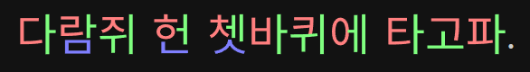
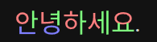

# Bunhae

한글을 음절별 각기 다른색으로 표시해 줄 수 있는 라이브러리입니다.<br>
초성검색, 자동완성, 받아쓰기, 폰트생성등에 유용할 수 있습니다.




<br><br>

## 설치

```bash
npm i bunhae
```

<br><br>

## 사용법

```typescript
import { Bunhae } from "bunhae";
customElements.define("bunhae-element", Bunhae);
```

```html
<style>
	bunhae-element {
		/* 초성 (기본값: currentColor) */
		--initial-color: red;

		/* 중성 (기본값: currentColor) */
		--medial-color: green;

		/* 이중모음(ㅘㅙㅚㅝㅞㅟㅢ) 중 오른쪽 (기본값: --medial-color) */
		--medial-secondary-color: yellow;

		/* 종성 (기본값: currentColor) */
		--final-color: blue;

		/* 쌍,겹받침(ㄲㄳㄵㄶㄺㄻㄼㄽㄾㄿㅀㅄㅆ) 중 오른쪽 (기본값: --final-color) */
		--final-secondary-color: violet;

		/* 한글 외 글자색 (기본값: --initial-color) */
		--text-color: white;
	}
</style>
```

```html
<bunhae-element>안녕하세요.</bunhae-element>
```



<br>

## [option] Flags 

```html
<bunhae-element flag="124">안녕하세요.</bunhae-element>
```

각 글자별 색 적용 여부를 36진수 플래그로 지정할 수 있습니다.<br>
비트연산으로 조합할 수 있으며 글자수가 더 많을 경우 마지막값을 사용합니다.<br>
문자열이 길 경우 **{갯수}** 로 늘릴 수 있습니다.

0일 경우 **color: currentColor;** 로 표시됩니다.

```js
초성 또는 한글 외 문자 = 1;	// 0b00001
중성 = 2;					// 0b00010
두번째중성 = 4;				// 0b00100 : 이중 모음(ㅘㅙㅚㅝㅞㅟㅢ) 중 오른쪽
종성 = 8;					// 0b01000 
종성 = g;					// 0b10000 : 쌍,겹받침(ㄲㄳㄵㄶㄺㄻㄼㄽㄾㄿㅀㅄㅆ) 중 오른쪽
```

#### 3글자만 적용


```html
<bunhae-element flags="vvv0">안녕하세요.</bunhae-element>
```


#### 초성만 적용

```html
<bunhae-element flags="1">안녕하세요.</bunhae-element>
```


#### 여러 글자 적용

```html
<bunhae-element flags="v{4}0">안녕하세요.</bunhae-element>
```


<br>

플래그가 설정되지 않았다면 "**v**"로 지정한것과 같습니다.

## [option] replace 

```html
<bunhae-element replace="false">안녕하세요.</bunhae-element>
```

기본적으로 innerHTML등 textContent가 변경될 경우 <u>**바뀐**</u> 글자만 렌더링합니다.<br>
매번 전체 렌더링을 원한다면 "**true**"로 지정가능합니다.

기본값은 "**false**"입니다.


## [option] cache 

```html
<bunhae-element cache="true">안녕하세요.</bunhae-element>
```

내부적으로 글자의 SVG를 캐시합니다. 차후 같은 글자가 나오면 캐시된 SVG를 사용합니다.

기본값은 "**true**"입니다.

<br><br>

## 동작방식 및 웹폰트 사용

Noto Sans KR 폰트를 수작업으로 재배열하고 조합한 커스텀 폰트를 사용합니다.

수정된 폰트 파일을 JS에서 직접 **fetch()** 하고 압축해제, 파싱해 SVG로 변환 후 원래 글자를 숨긴 후 위에 표시해주기 때문에 **CSS 웹폰트를 추가해줄 필요는 없습니다**.

글자를 숨기고 그 위에 Noto Sans KR 폰트 모양으로 렌더링하기 때문에 자간이나 장평, 줄간격등은 숨겨진 글자의 font-family의 의해 결정됩니다.

따라서 렌더링 후 글자의 바운딩 크기등은 숨긴 글자와 일치하나 숨긴 글자 폰트가 정사각형 모양이 아닌 경우 볼품 없어 질 수 있습니다.

**FOUT등을 감수하고 장평, 자간등을 Noto Sans KR에 더 어울리게 렌더링을 하고싶다면**

웹페이지에 웹폰트도 로딩해 웹폰트를 숨겨진 글자로 사용하는 방법도 있습니다.

```html
<link 
	rel="stylesheet" 
	href="https://cdn.jsdelivr.net/npm/bunhae-fonts/dist/Noto-Sans-KR-Regular.css"
	crossorigin 
/>
```

```html
<bunhae-element style="font-family:'Noto Sans KR Bunhae';">
	안녕하세요.
</bunhae-element>
```

<br><br>

## 프리로드

분해 폰트는 자주 쓰는 한글 2780자 폰트<small>(194kb)</small>와 그 밖에 글자들이 56개의 폰트<small>(625kb)</small>로 나눠져 있습니다.

그중 자주쓰는 2780자 폰트는 프리로드하는 것도 좋을 수 있습니다.

```html
<link
	rel="preload"
	href="https://cdn.jsdelivr.net/npm/bunhae-fonts/dist/Noto-Sans-KR-Regular/Bunhae.woff2"
	as="fetch"
	crossorigin
/>
```

페이지 로딩 이 후 사용한다면 로딩 시 아래와 같은 코드를 추가하는 것 또한 좋을 수 있습니다.

```typescript
import { Bunhae } from "bunhae";
Bunhae.preload();
```
